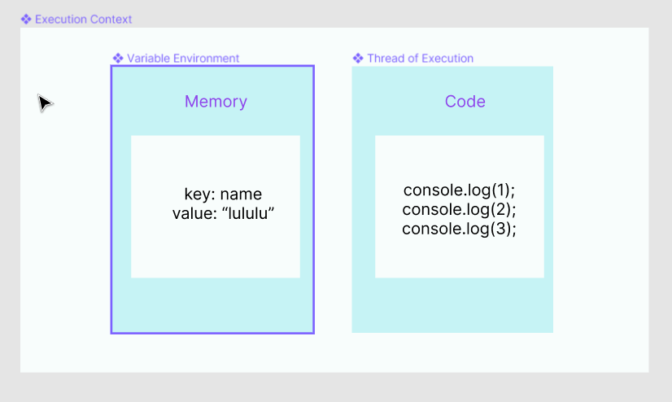

# 执行上下文
## 什么是执行上下文
> "Everything in JavaScript happens inside an Execution Context"

### two components
执行上下文由两部分组成：
1. Variable Environment
- 也可以叫做Memory，主要存放key-value键值对
2. Thread of Execution
- 也可以叫Code，所有的JS代码都是在这里运行的，JS代码都是一行执行完成之后再执行下一行，一个时间内JS只能执行一行代码，所以"JavaScript is a synchronous single-threaded language"

### two phases
执行上下文分两个阶段创建。
1. Memory Creation Phase
- 为所有的变量和函数分配内存
    - 变量中存放的是一个特殊的值：undefined
    - 函数中存放的就是整个函数代码
1. Code Execution Phase
- 按行执行JS代码

## 执行上下文的创建
有三种类型的代码可以创建执行上下文
1. 全局上下文
- 全局上下文是为了运行代码主体而创建的执行上下文。即存在于JavaScript函数之外的任何代码。
2. 函数上下文
- 每个函数都在自己的执行上下文中运行。这通常被称为“本地上下文”(local context)
3.  eval()

## 执行上下文的管理
> "Call stack maintains the order of execution of execution contexts"

## 参考
- [Namaste JavaScript 🙏 Ep.1-Ep.2](https://www.youtube.com/playlist?list=PLlasXeu85E9cQ32gLCvAvr9vNaUccPVNP)
- [javascript execution context](https://developer.mozilla.org/en-US/docs/Web/API/HTML_DOM_API/Microtask_guide/In_depth#javascript_execution_contexts)