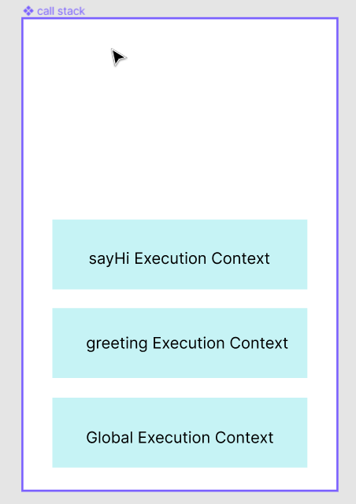

# 调用栈
> "Call stack maintains the order of execution of execution contexts"

> "one thread == one call stack == one thing at a time"

## 栈结构
栈是一种后进先出（Last In First Out）的数据结构

call stack记录了我们在程序中的位置。如果我们调用一个函数，我们会将该函数上下文压入堆栈，如果我们执行完一个函数，我们会从栈顶弹出该函数上下文。

```javascript
function greeting() {
    function sayHi() {
        console.log("hi~");
    }

    sayHi();
}

console.log("Lucy is here");
greeting();
```

