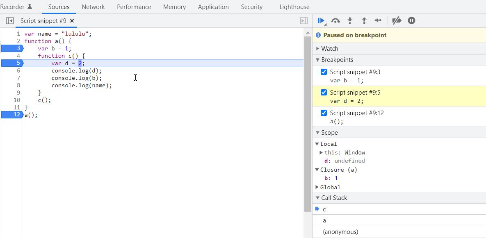

# 作用域
作用域的定义：能够访问到变量和函数的地方
JavaScript中变量的作用域由词法作用域决定

## 词法作用域
> 维基百科：静态作用域又叫做词法作用域，采用词法作用域的变量叫词法变量。词法变量有一个在编译时静态确定的作用域。词法变量的作用域可以是一个函数或一段代码，该变量在这段代码区域内可见，在这段区域以外该变量不可见。词法作用域里，取变量的值时，会检查函数**定义时的文本环境**，捕捉函数定义时对该变量的绑定。


## 执行上下文与作用域
每个执行上下文都有自己的作用域，Variable Environment就是执行上下文的本地内存空间(local memory space)。

### 全局上下文
全局上下文的Variable Environment叫做全局作用域(Global Scope)。JS引擎在创建全局上下文的同时，创建了一个全局对象(Global Object)和this，在浏览器环境中，这个全局对象是Window对象，this指向Window。

存在于JavaScript函数之外的任何代码存在于全局上下文中
在全局上下文中使用var声明的变量和function关键字声明的函数都会被附加到全局对象Window上面。

### 函数上下文
函数上下文也叫本地上下文(local context)，所以函数上下文的Variable Environment叫做本地作用域(Local Scope)。

## 作用域链(Scope Chain)
> the whole chain of this lexical environment is called the scope chain

由词法作用域的定义可知：词法作用域是由我们在写代码时将变量和函数写在哪里决定的，词法(lexical)通常也意味着层次结构或顺序。

词法环境(Lexical Environment)= 本地内存空间(Variable Environment) + 父母的词法环境(parent's lexical environment)

词法环境链接起来就得到了作用域链。

举个🌰：函数c写在函数a内，所以函数c的lexical parent就是函数a
```javascript
var name = "lululu";
function a() {
    var b = 1;
    function c() {
        var d = 2;
        console.log(d);
        console.log(b);
        console.log(name);
    }
    c();
}
a();
```
图片说明：
- 函数c能够访问到d，因为d在函数c的Local Scope中
- 函数c的lexical parent是a，所以在c中能够访问到a中的变量
- 函数a的lexical parent是Global Scope，所以c也能够访问到Global Scope中的变量name
- c的作用域链 = c的Local Scope + a的Local Scope + Global Scope




## 参考
- [Namaste JavaScript 🙏 Ep.4-Ep.5 + Ep.7](https://www.youtube.com/playlist?list=PLlasXeu85E9cQ32gLCvAvr9vNaUccPVNP)