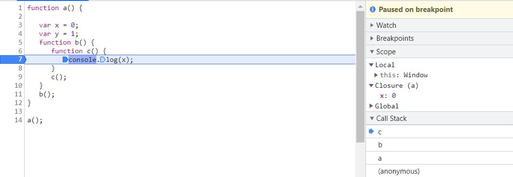
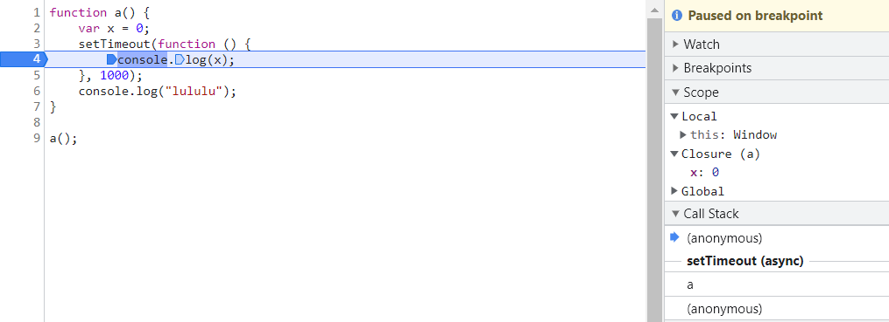

# 闭包
> closure is a function bundled with its lexical environment

> function along with its lexical scope forms a closure

> closure enclosed function along with its lexical scope

## 用🌰认识闭包
闭包是由一个函数加它的词法作用域形成的。就是当一个函数内部引用了它外部词法作用域中函数内的变量，则形成了闭包。

### 简单的闭包🌰
来看一个我觉得很简单的🌰
```javascript
function a() {
   var x = 0;
   var y = 1;
   function b() {
      function c() {
         console.log(x);
      }
      c();
   }
   b();
}

a();
```
图片说明：
- 由图可以看出，因为函数c内部使用了它作用域链上的a函数里的变量x，所以形成了闭包(a)
- 闭包a里面只有x变量，因为函数c只使用了x变量
  


### 稍微复杂的🌰
1. 当闭包和异步函数结合时
- 先输出"lululu"，1s之后输出0
```javascript
function a() {
    var x = 0;
    setTimeout(function () {
        console.log(x);
    }, 1000);
    console.log("lululu");
}

a();
```
图片说明：
- setTimeout内的匿名函数使用了它作用域链上的函数a内的变量，所以形成了闭包a
  


和前面的例子也没啥区别嘛，不过当它和循环结合起来就会有些复杂了~

---
2. 当闭包和异步函数以及循环结合时
- 我们想要的结果是，1s之后输出1，2s之后输出2，3s之后输出3
- 结果是连续输出3次的都是4
```javascript
function a() {
    for(var i = 1; i <= 3; i++) {
       setTimeout(function() {
           console.log(i);
       }, i * 1000);
   }

   console.log("lululu");
}

a();
```
结果说明：
由前面的例子我们可以很清楚的知道，setTimeout中的匿名函数使用了它作用域链中函数a内的变量i，形成了闭包a，由于setTimeout是异步的，所以当循环结束后i的值为4，此时才开始执行setTimeout内的匿名函数，匿名函数内使用i是对i的内存地址的引用，当时i内存地址存放的值是4，所以最后打印的结果都是4。

---

那怎么能达到我们想要的结果呢？核心就是setTimeout内引用i的值应该每次都要不同。

解决方法1：使用let
- 因为let在块中具有块作用域，所以每次循环体内的i都是不同的，所以setTimeout内匿名函数中最终引用的i的值也是不同的。
```javascript
function a() {
    for(let i = 1; i <= 3; i++) {
       setTimeout(function() {
           console.log(i);
       }, i * 1000);
   }

   console.log("lululu");
}

a();
```

解决方法2：利用闭包传参
- 创建一个函数close，每次循环调用close并传递i值，setTimeout中的匿名函数引用的是close函数内的变量value，所以形成了闭包close，因为每次传参的value都不同，所以setTimeout内匿名函数引用的value值也各不相同。
```javascript
function a() {
   for(var i = 1; i <= 3; i++) {
        function close(value) {
            setTimeout(function() {
                console.log(value);
            }, value * 1000);
       }
       close(i);
   }

   console.log("lululu");
}

a();
```

## 参考
- [Namaste JavaScript 🙏 Ep.12-Ep.13](https://www.youtube.com/playlist?list=PLlasXeu85E9cQ32gLCvAvr9vNaUccPVNP)